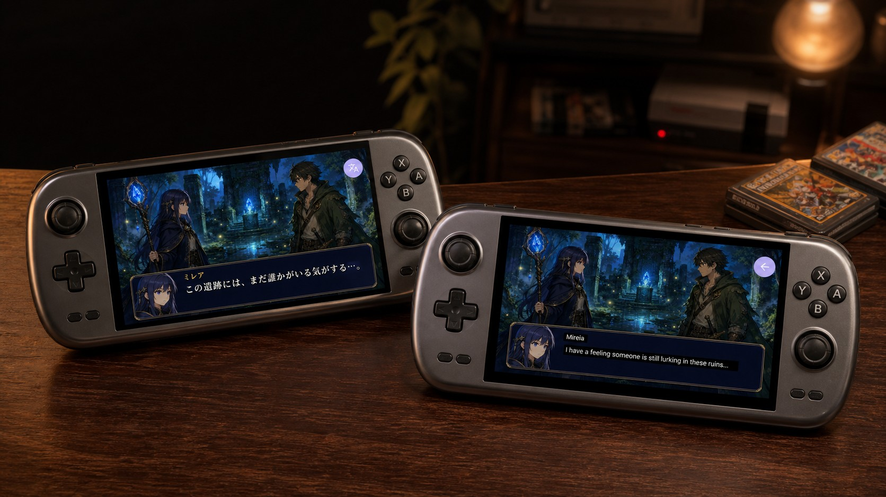
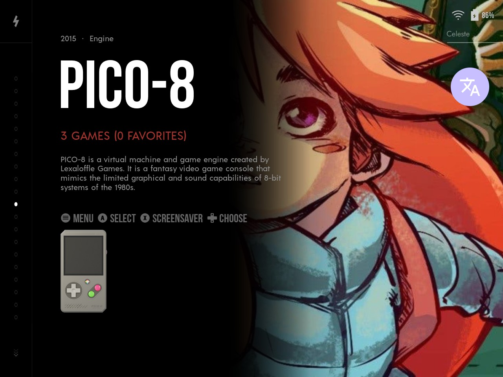
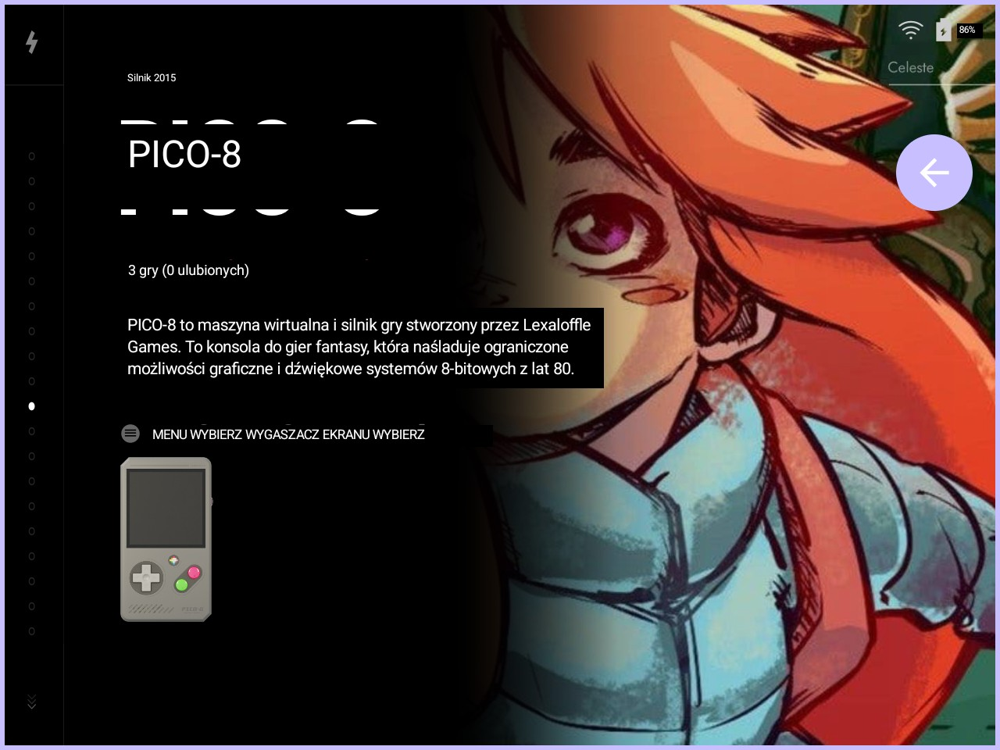
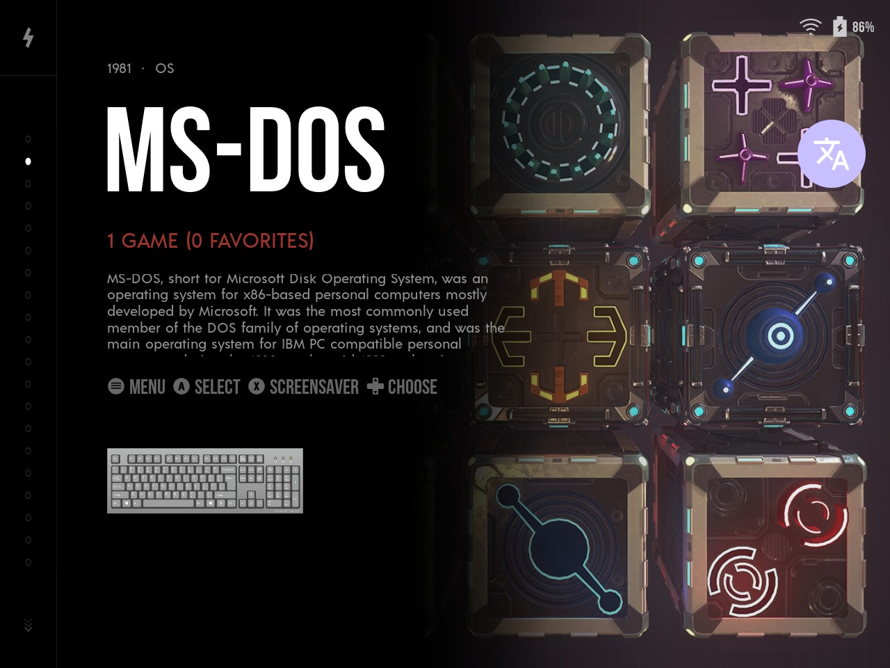
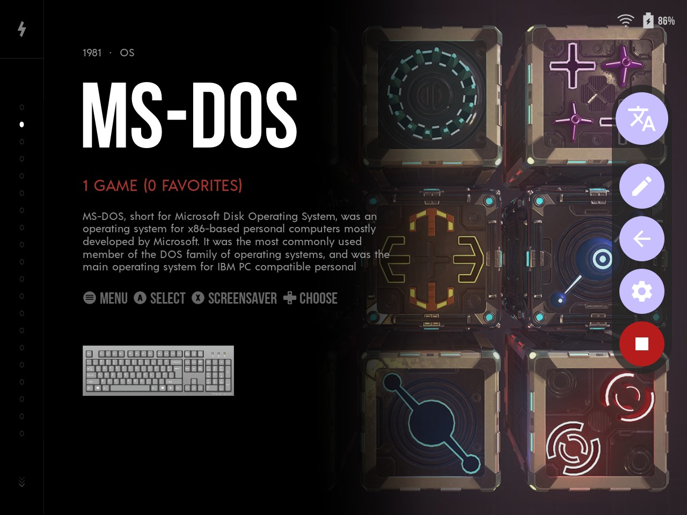
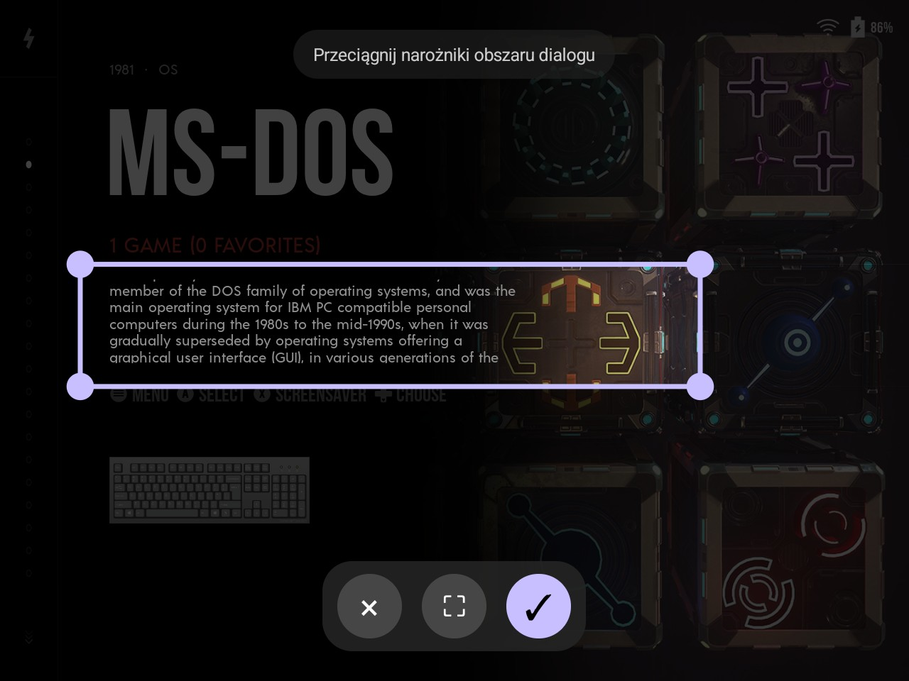
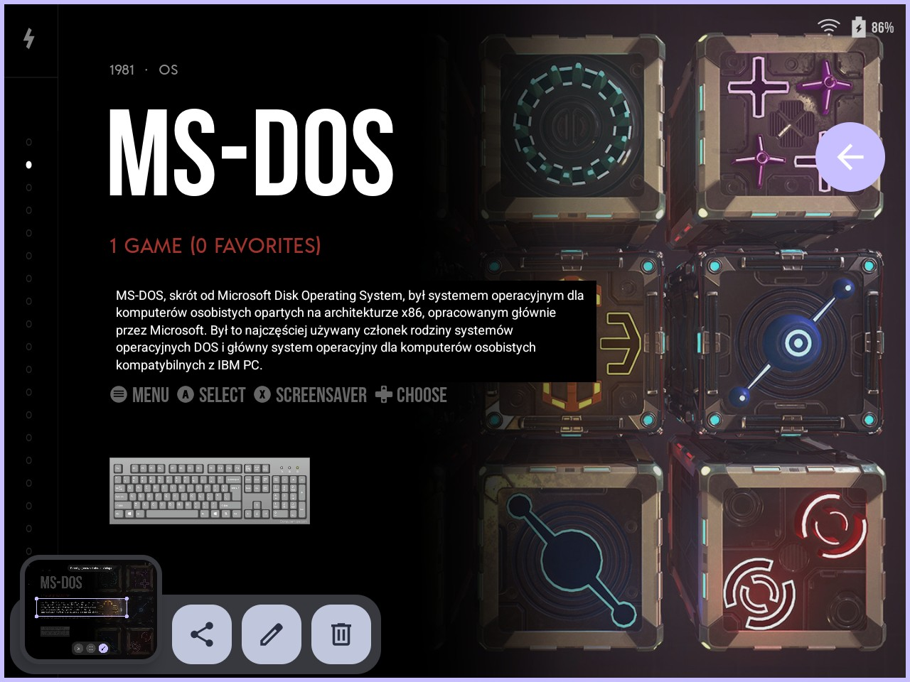
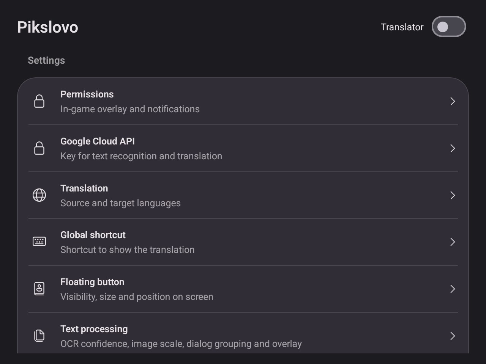
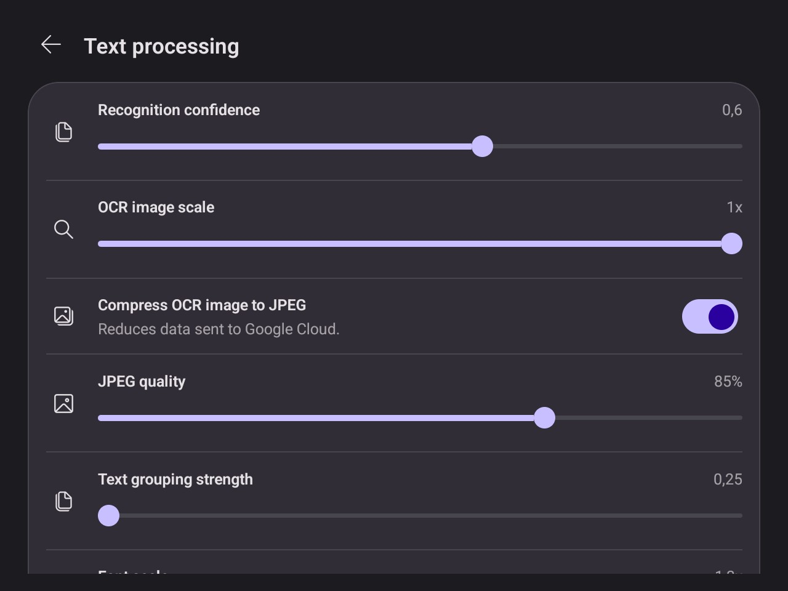
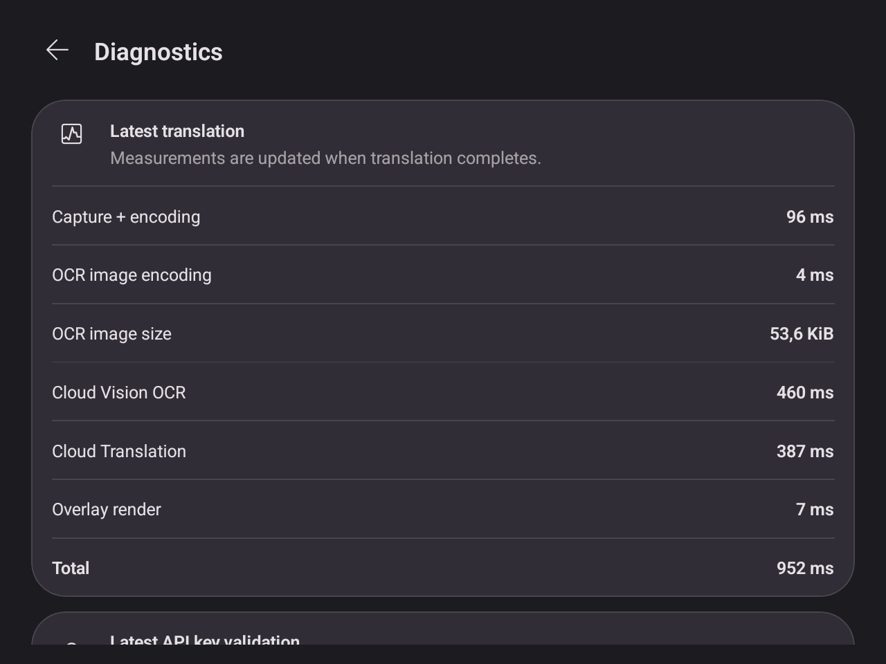

# Pikslovo

Pikslovo is an Android app for translating text visible inside games and other apps.

It is meant for quick, on-demand translation of what is currently on screen, especially dialogue boxes, menus, and interface text.

## Translation in action

The following example shows the translation flow, from selecting text on screen to reading the translated result.

  
  
  

  
  
  

## App preview

  
  
  
  

## What it does

Pikslovo lets you:

- translate the currently visible text from another app or game,
- show the translation on top of the captured screen,
- trigger translation with a floating button,
- trigger translation with a global hotkey,
- choose whether to translate the whole screen or only a selected region,
- set source and target languages,
- save your settings on the device,
- import and export settings,
- use your own Google Cloud API key.

## Install

[](https://apps.obtainium.page/redirect?r=obtainium%3A%2F%2Fapp%2F%7B%22id%22%3A%22app.pikslovo%22%2C%22url%22%3A%22https%3A%2F%2Fgithub.com%2Fsebastianhaba%2Fpikslovo%22%2C%22author%22%3A%22sebastianhaba%22%2C%22name%22%3A%22Pikslovo%22%2C%22otherAssetUrls%22%3Anull%2C%22apkUrls%22%3Anull%2C%22preferredApkIndex%22%3A0%2C%22additionalSettings%22%3A%22%7B%5C%22includePrereleases%5C%22%3Afalse%2C%5C%22fallbackToOlderReleases%5C%22%3Atrue%2C%5C%22filterReleaseTitlesByRegEx%5C%22%3A%5C%22%5C%22%2C%5C%22filterReleaseNotesByRegEx%5C%22%3A%5C%22%5C%22%2C%5C%22verifyLatestTag%5C%22%3Afalse%2C%5C%22sortMethodChoice%5C%22%3A%5C%22date%5C%22%2C%5C%22useLatestAssetDateAsReleaseDate%5C%22%3Afalse%2C%5C%22releaseTitleAsVersion%5C%22%3Afalse%2C%5C%22github-creds%5C%22%3A%5C%22%5C%22%2C%5C%22GHReqPrefix%5C%22%3A%5C%22%5C%22%2C%5C%22trackOnly%5C%22%3Afalse%2C%5C%22versionExtractionRegEx%5C%22%3A%5C%22%5C%22%2C%5C%22matchGroupToUse%5C%22%3A%5C%22%5C%22%2C%5C%22versionDetection%5C%22%3Atrue%2C%5C%22releaseDateAsVersion%5C%22%3Afalse%2C%5C%22useVersionCodeAsOSVersion%5C%22%3Afalse%2C%5C%22apkFilterRegEx%5C%22%3A%5C%22%5C%22%2C%5C%22invertAPKFilter%5C%22%3Afalse%2C%5C%22autoApkFilterByArch%5C%22%3Atrue%2C%5C%22appName%5C%22%3A%5C%22%5C%22%2C%5C%22appAuthor%5C%22%3A%5C%22%5C%22%2C%5C%22shizukuPretendToBeGooglePlay%5C%22%3Afalse%2C%5C%22allowInsecure%5C%22%3Afalse%2C%5C%22exemptFromBackgroundUpdates%5C%22%3Afalse%2C%5C%22skipUpdateNotifications%5C%22%3Afalse%2C%5C%22about%5C%22%3A%5C%22%5C%22%2C%5C%22refreshBeforeDownload%5C%22%3Afalse%2C%5C%22includeZips%5C%22%3Afalse%2C%5C%22zippedApkFilterRegEx%5C%22%3A%5C%22%5C%22%7D%22%2C%22categories%22%3A%5B%22Translation%22%5D%2C%22overrideSource%22%3A%22GitHub%22%2C%22allowIdChange%22%3Afalse%7D)

Install [Obtainium](https://github.com/ImranR98/Obtainium) on your Android device, then use this button to add Pikslovo and receive updates from its GitHub releases.

## How it works

The app captures the current screen, recognizes the visible text, translates it, and shows the result as an overlay.

The workflow is simple:

1. Start a translation session.
2. Open the game or app you want to translate.
3. Trigger translation.
4. Read the translated overlay.

## Main features

- Whole-screen or selected-region translation
- Floating trigger button
- Global hotkey support
- Source and target language selection
- On-device settings storage
- Settings import and export
- Overlay-based result display

## Current scope

The current version focuses on single, manually triggered translations of the current screen content.

It does not aim to be a constant live translator running on every screen update.

## Requirements

- The app runs on Android only.
- The user provides their own Google Cloud API key.
- The app is currently intended for Android 12 and newer.

## Tested devices and systems

Manual testing was performed on the following devices and operating systems:

- ANBERNIC RG 477M running GammaOS
- Samsung Galaxy S21 FE running Android 16

## Credits and inspiration

The original idea for Pikslovo came from using [Decky-Translator](https://github.com/cat-in-a-box/Decky-Translator) on a Steam Deck. Its screenshot-based OCR, translation, and temporary translated-screen overlay inspired this app's translation workflow.

The visual direction of Pikslovo is inspired by [PlayTranslate](https://github.com/dominostars/playtranslate), an Android-focused screen translation app.

## Built with Uno Platform

Pikslovo is built with [Uno Platform](https://platform.uno/), which lets us develop the Android app in C# and XAML.

## How AI was used

This app was not created from a single prompt. It is the result of several weeks of manual testing, iterative fixes, refactoring, and many prompts. Codex and OpenGo were used as part of an experiment in using AI tools to build a complete Android application that looks polished while using XAML and C#.
